# Complete Application Function Call Flow

## Comprehensive Mermaid Diagram: Complete Function Call Flow

```mermaid
graph TD
    %% ========================================
    %% Entry Points
    %% ========================================
    User[👤 User Interface] --> RefApp[regulatory_processor.py: AppState]
    RefApp --> StartProc[AppState.start_processing]
    StartProc --> BGTask[AppState.run_processing_background]
    BGTask --> ProcFolderEnh[processor.py: process_folder_enhanced]

    %% ========================================
    %% Main Processing Orchestration
    %% ========================================
    ProcFolderEnh --> DocProc[DocumentProcessor.__init__]
    DocProc --> ProcFolder[DocumentProcessor.process_folder]

    %% Setup and Validation Phase
    ProcFolder --> ValidateFolder[DocumentProcessor._validate_folder_path]
    ProcFolder --> LoadMapping[DocumentProcessor._load_and_validate_mapping]
    LoadMapping --> LoadMappingTable[utils.py: load_mapping_table]
    ProcFolder --> InitDateFormatter[date_formatter.py: initialize_date_formatter]
    ProcFolder --> SetupFileManager[FileManager setup]
    ProcFolder --> DiscoverDocs[FileManager.discover_processable_documents]

    %% Document Processing Loop
    ProcFolder --> ProcSingleDoc[DocumentProcessor._process_single_document]
    ProcSingleDoc --> IdentifyDoc[utils.py: identify_document_country_and_language]
    ProcSingleDoc --> FindMappingRows[utils.py: find_mapping_rows_for_language]
    ProcSingleDoc --> CreateBackup[FileManager.create_backup]

    %% ========================================
    %% Document Variant Processing (PER COUNTRY)
    %% ========================================
    ProcSingleDoc --> ProcVariant[DocumentProcessor._process_document_variant]
    ProcVariant --> LoadDoc[docx.Document load]
    ProcVariant --> DocUpdater[DocumentUpdater.apply_all_updates]

    %% ========================================
    %% Document Update Chain (CRITICAL CONTENT PROCESSING)
    %% ========================================
    DocUpdater --> UpdateReporting[update_document_with_fixed_smpc_blocks]
    DocUpdater --> UpdateAnnexIDate[update_section_10_date]
    DocUpdater --> UpdateAnnexIIIBDate[update_annex_iiib_date]
    DocUpdater --> UpdateLocalReps[update_local_representatives]

    %% ========================================
    %% Content Update Details - SMPC Blocks
    %% ========================================
    UpdateReporting --> FindSmPCSection[locate SmPC Section 4.8]
    UpdateReporting --> FindPLSection[locate PL Section 4]
    UpdateReporting --> ReplaceContent[replace section content]
    UpdateReporting --> CreateHyperlinks[hyperlinks.py: create_hyperlink_run_enhanced]

    %% ========================================
    %% Content Update Details - Date Processing
    %% ========================================
    UpdateAnnexIDate --> FormatDateCountry[date_formatter.py: format_date_for_country]
    UpdateAnnexIIIBDate --> FormatDateCountry
    FormatDateCountry --> DateFormatterSystem[DateFormatterSystem.format_date]
    DateFormatterSystem --> ParseCustomFormat[DateFormatterSystem._parse_custom_format]
    ParseCustomFormat --> GetMonthName[DateFormatterSystem._get_month_name]

    %% ========================================
    %% Content Update Details - Local Representatives
    %% ========================================
    UpdateLocalReps --> FilterLocalReps[filter_local_representatives]

    %% Table Processing (PRIMARY)
    FilterLocalReps --> TryTableProc[LocalRepTableProcessor.process_local_rep_table]
    TryTableProc --> LocateTable[LocalRepTableProcessor._locate_local_rep_table]
    LocateTable --> ValidateTable[LocalRepTableProcessor._table_contains_country]
    TryTableProc --> FilterTable[LocalRepTableProcessor._filter_table_content]
    FilterTable --> ProcessTableRow[LocalRepTableProcessor._process_table_row]
    ProcessTableRow --> CellStartsWith[LocalRepTableProcessor._cell_starts_with_country]
    ProcessTableRow --> CellMerge[cell.merge operations]
    FilterTable --> CleanupEmpty[LocalRepTableProcessor._cleanup_empty_rows]

    %% Paragraph Processing (FALLBACK)
    FilterLocalReps --> FallbackParagraph[_filter_local_representatives_paragraphs]

    %% ========================================
    %% Document Splitting and Output
    %% ========================================
    ProcVariant --> SaveAndSplit[DocumentProcessor._save_and_split_document]
    SaveAndSplit --> SaveDoc[Document.save combined]
    SaveAndSplit --> SplitAnnexes[split_annexes wrapper]
    SplitAnnexes --> CloneAndSplit[document_splitter.py: clone_and_split_document]

    %% Splitting Details
    CloneAndSplit --> CloneSource[clone_source_document]
    CloneAndSplit --> FindBoundaries[find_annex_boundaries]
    FindBoundaries --> NormalizeText[normalize text for matching]
    FindBoundaries --> IsHeaderMatch[utils.py: is_header_match]
    CloneAndSplit --> PruneToAnnex[prune_to_annex_with_boundaries]
    PruneToAnnex --> KeepParagraphElements[build keep_paragraph_elements set]
    PruneToAnnex --> DeleteElements[delete elements from document tree]
    CloneAndSplit --> GenerateFilename[_generate_annex_filename]

    %% ========================================
    %% PDF Conversion (ERROR-PRONE)
    %% ========================================
    SaveAndSplit --> ConvertPDF[convert_to_pdf]
    ConvertPDF --> LibreOffice[utils.py: LibreOffice conversion ❌ FAILING]
    ConvertPDF --> Docx2PDF[utils.py: docx2pdf conversion ❌ FAILING]
    ConvertPDF --> Pandoc[utils.py: pandoc conversion ❌ FAILING]
    ConvertPDF --> Placeholder[Create placeholder file ✅]

    %% ========================================
    %% Result Processing and Completion
    %% ========================================
    ProcFolder --> GenerateResult[DocumentProcessor._generate_final_result]
    GenerateResult --> BGComplete[AppState.handle_processing_complete]
    BGComplete --> UIUpdate[Update UI with results]

    %% ========================================
    %% Error Handling and Exceptions
    %% ========================================
    LoadMappingTable --> MappingError[exceptions.py: MappingError]
    ValidateFolder --> ValidationError[exceptions.py: ValidationError]
    LoadDoc --> DocumentError[exceptions.py: DocumentError]
    ConvertPDF --> ProcessingError[exceptions.py: ProcessingError]

    %% ========================================
    %% Utility Functions (Supporting)
    %% ========================================
    IdentifyDoc --> ExtractCountryCode[utils.py: extract_country_code_from_filename]
    IdentifyDoc --> GetCountryCodeMapping[utils.py: get_country_code_mapping]
    GenerateFilename --> GenerateOutputFilename[utils.py: generate_output_filename]
    IsHeaderMatch --> NormalizeTextForMatching[utils.py: normalize_text_for_matching]
    IsHeaderMatch --> ContainsAsWords[utils.py: contains_as_words]
    IsHeaderMatch --> AreSimilarHeaders[utils.py: are_similar_headers]

    %% ========================================
    %% Configuration and Setup
    %% ========================================
    DocProc --> ProcessingConfig[config.py: ProcessingConfig]
    CreateHyperlinks --> URLValidationConfig[config.py: URLValidationConfig]
    CreateHyperlinks --> ValidateURL[hyperlinks.py: validate_url_format]
    ValidateURL --> ValidateMailto[hyperlinks.py: _validate_mailto_url]
    ValidateURL --> ValidateWebURL[hyperlinks.py: _validate_web_url]
    ValidateURL --> AutoFixURL[hyperlinks.py: _auto_fix_url_format]
    CreateHyperlinks --> AddHyperlinkRel[hyperlinks.py: add_hyperlink_relationship]

    %% ========================================
    %% Styling and Classifications
    %% ========================================
    classDef errorNode fill:#ffcccc,stroke:#cc0000,stroke-width:2px
    classDef successNode fill:#ccffcc,stroke:#00cc00,stroke-width:2px
    classDef criticalNode fill:#ffffcc,stroke:#cccc00,stroke-width:3px
    classDef newFeature fill:#ccccff,stroke:#0000cc,stroke-width:2px
    classDef utilityNode fill:#f0f0f0,stroke:#666666,stroke-width:1px
    classDef configNode fill:#e6ffe6,stroke:#009900,stroke-width:1px

    %% Apply Classifications
    class UpdateLocalReps,FilterLocalReps,TryTableProc,LocateTable,FilterTable,ProcessTableRow,CleanupEmpty successNode;
    class DocUpdater,ProcVariant,SaveAndSplit criticalNode;
    class LibreOffice,Docx2PDF,Pandoc errorNode;
    class Placeholder,SaveDoc,SplitAnnexes,CloneAndSplit successNode;
    class TryTableProc,LocateTable,FilterTable,ProcessTableRow newFeature;
    class ExtractCountryCode,GetCountryCodeMapping,NormalizeTextForMatching,ContainsAsWords utilityNode;
    class ProcessingConfig,URLValidationConfig,DateFormatterSystem configNode;
```

## Flow Analysis Summary

### ✅ Successfully Working Components
- **Local Representative Processing**: Complete table-based filtering with cell merging
- **Document Splitting**: Clone-and-prune approach with perfect scaffolding preservation
- **Date Formatting**: Country-specific date formatting with locale support
- **Content Updates**: SmPC blocks, hyperlinks, and section updates
- **Document Discovery**: File manager with backup creation

### ❌ Known Issues
- **PDF Conversion**: All three methods (LibreOffice, docx2pdf, pandoc) failing consistently
- **Worker Timeouts**: Resolved through background task implementation

### 🆕 Recent Additions
- **LocalRepTableProcessor**: Table-based local rep filtering (298 lines)
- **Enhanced Hyperlinks**: URL validation and relationship management
- **Background Processing**: Prevents UI blocking and worker timeouts

### 🔧 Key Integration Points
1. **AppState.run_processing_background** → **process_folder_enhanced**: Main processing entry
2. **DocumentUpdater.apply_all_updates**: Central content modification hub
3. **clone_and_split_document**: Modern document splitting with boundary detection
4. **LocalRepTableProcessor**: Direct table access via doc.tables[-1]
