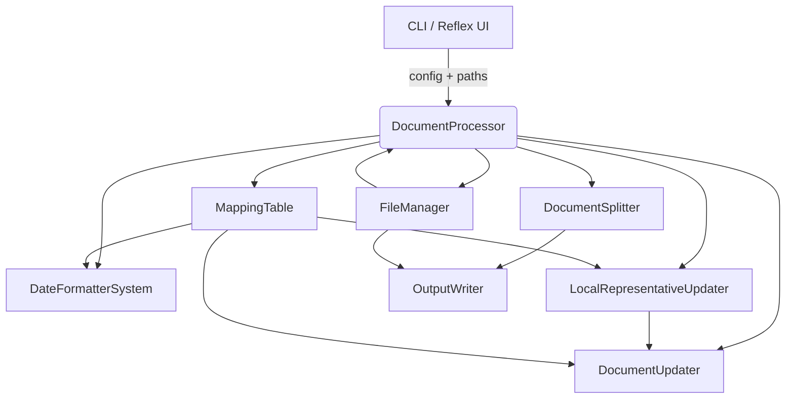

# Document Processing Pipeline Design

## 1. Overview
This design describes how to implement the eight-step regulatory document processing pipeline defined in the requirements. The solution enhances the existing `regulatory_processor` package by orchestrating file management, document transformation, and export operations driven by a mapping Excel file. The processor must run in batch mode, tolerate per-document failures, and generate Annex-specific deliverables in DOCX and PDF formats.

## 2. Goals and Non-Goals
### Goals
- Automate the end-to-end pipeline for every document/mapping row pair (Reqs 1–8).
- Preserve document formatting, hyperlinks, and structure while injecting updated national reporting content.
- Provide clear logging, statistics, and recoverable error handling for large batches.
- Make PDF conversion optional/configurable while defaulting to enabled behavior.

### Non-Goals
- Editing input mapping files or validating their business accuracy beyond structural checks.
- Providing a GUI workflow (the existing Reflex app can invoke the API but UI changes are out of scope).
- Supporting non-DOCX inputs or Annex types beyond I and IIIB.

## 3. High-Level Architecture
The design builds on the existing modular layout. Key components interact as follows:

- **DocumentProcessor** orchestrates iteration over discovered files and coordinates subcomponents.
- **FileManager** validates inputs, sets up output folders, creates backups, and handles PDF conversion.
- **MappingTable** loads and caches the Excel data, exposing row lookups by country/language or filename pattern.
- **DocumentUpdater** handles SmPC/PL block replacement, target text removal, hyperlink formatting, and general docx manipulation.
- **DateFormatterSystem** formats dates according to locale-aware templates from the mapping file.
- **LocalRepresentativeUpdater** isolates relevant rows within the representative table.
- **DocumentSplitter** extracts Annex I/IIIB segments and produces new DOCX files via `python-docx` cloning helpers.

## 4. Data Model and Configuration
- **ProcessingConfig** (existing) will gain flags for optional PDF conversion, backup behavior, overwrite policy, and logging level. Defaults follow requirements (PDF conversion on, backups enabled, overwrite disabled).
- **MappingRow** (new dataclass) encapsulates parsed mapping values for a document, including lists for multi-country fields (`countries`, `smpc_lines`, `pl_append_text`, `hyperlinks`, `emails`, `local_rep_countries`, etc.). It normalizes semicolon-delimited cells, trimming whitespace and preserving order to align per-country columns.
- **ProcessingStats** (existing) enhanced to track counts for successes, warnings, skipped documents, PDF failures, and annex splits.

## 5. File Discovery & Validation (Req 1)
1. `FileManager.discover_processable_documents(input_dir)` returns docx paths matching naming convention regex `^(?P<product>.+?)_(?P<country>[A-Z]{2})_(?P<language>[A-Z]{2}).docx$` (configurable).
2. `MappingTable.load(path)` reads Excel via pandas, validates required columns, and precomputes dictionaries keyed by `(country_code, language)` and by filename prefix if provided.
3. For each discovered file, `DocumentProcessor` extracts country/language, queries `MappingTable`. On failure, log and move file to `errors` folder.
4. Output directories created under `/output/{timestamp}/{country_group}/docx|pdf` and backups stored adjacent to original unless configuration overrides.

## 6. Per-Document Processing Flow

### 6.1 SmPC/PL Block Construction (Reqs 2–4)
- **Input**: `MappingRow.countries`, `MappingRow.smpc_lines`, `MappingRow.hyperlinks`, `MappingRow.emails`.
- For each country index `i`:
  - Build `CountryBlock` data structure with `name`, ordered `lines`, `hyperlinks`, `emails`.
  - Validate that hyperlink/email substrings appear in respective lines; if not, record warning but continue.
  - Use `python-docx` to create paragraphs with controlled formatting: first line bold (country name), subsequent lines normal text. Hyperlinks inserted via helper that creates relationship IDs (reuse `document_utils.create_hyperlink`). Email addresses use `mailto:` scheme.
- Compose block paragraphs with `\n` separators converted to separate paragraphs. Between blocks insert empty paragraph (double line break effect).
- Persist built blocks for reuse in PL section plus appended text (from `MappingRow.pl_append_text`).

### 6.2 Target Text Replacement (Req 4)
- Identify SmPC and PL target text runs using mapping columns (e.g., `Original text national reporting - SmPC/PL`). Implementation uses `document_utils.find_text_runs(document, target_text)` returning start/end run indexes.
- Remove existing runs and insert block paragraphs using `document_utils.replace_runs_with_paragraphs` helper to preserve style context.
- Insert appended PL text after entire block set. If appended text contains hyperlink placeholders, apply same detection logic.

### 6.3 Date Updates (Req 5)
- `DateFormatterSystem` obtains locale metadata using mapping row: `Annex I Date Format`, `Annex IIIB Date Format`, plus header strings.
- `DocumentUpdater.update_annex_date(document, header_text, format_pattern)` locates header by normalized comparison (case-insensitive, trimmed). For Annex I, replace next paragraph text with formatted date. For Annex IIIB, replace placeholder token within the paragraph matching `Annex IIIB Date Text` (e.g., string with `{DATE}` placeholder) using regular expressions while preserving surrounding runs and style.
- Date sources default to processing date; allow override for testing via config.

### 6.4 Local Representative Table Filtering (Req 6)
- Locate table containing "Local Representative" header. Iterate rows/cells searching for paragraphs where text matches one of the mapping countries (case-insensitive, after removing accents optionally).
- Identify contiguous paragraphs constituting a country block by scanning until next bold paragraph or blank line. Use `python-docx` style info to maintain bolding for country names; ensure bold formatting applied using mapping-provided display names.
- Remove table rows/cells not in selected set. If a required country block absent, log warning and proceed.

### 6.5 Annex Splitting (Req 7)
- Use `DocumentSplitter.find_header_positions(document, headers)` to locate indexes for Annex I, Annex II, Annex IIIB based on mapping-provided localized strings. Implement tolerance for uppercase, whitespace, numbering variations by normalizing text and using regex like `r"^annex\s+i\b"` or localized equivalent.
- Extract document portions: Annex I = start to Annex II header, Annex IIIB = Annex IIIB header to end. Create new `Document` objects by cloning relevant elements (paragraphs, tables, headers/footers) using docx XML deep copy to maintain formatting.
- Determine combined country list string (e.g., `Ireland_Malta`). Generate filenames accordingly and ensure uniqueness via FileManager (append `_v2` if conflict).

### 6.6 Output Writing & PDF Conversion (Req 8)
- Save Annex DOCX files into `output_root/<country_group>/docx/`.
- If `config.convert_to_pdf` true, call `FileManager.convert_to_pdf(docx_path, pdf_path)` using `docx2pdf` by default, fallback to LibreOffice CLI on failure. Capture errors; mark `ProcessingStats.pdf_failures`.
- Maintain manifest JSON or CSV summarizing original file, annex outputs, statuses.

## 7. Error Handling and Logging
- Use structured logging with per-document context (document name, country list).
- Wrap each major step in try/except; raise `DocumentError` for non-recoverable issues (e.g., corrupted docx). For recoverable warnings (missing hyperlink text) use `logger.warning` and continue.
- Collect warnings in `ProcessingResult.warnings` list returned to caller for UI display.
- Ensure partial outputs cleaned up on failure to avoid orphaned files.

## 8. Performance Considerations
- Reuse loaded mapping data across documents; avoid re-reading Excel per document.
- Minimize repeated docx saves by batching modifications before writing once per annex.
- Optionally parallelize per-document processing in future (out of scope now) but design ensures components stateless or using thread-safe data.

## 9. Testing Strategy
- **Unit Tests**: Cover parsing of mapping rows, hyperlink insertion helpers, date formatter patterns, annex splitter header detection, and local representative filtering logic.
- **Integration Tests**: Use fixture DOCX files representing single-country and multi-country scenarios to assert final document structure, inserted text, and hyperlink existence. Validate Annex splitting results and naming conventions.
- **Regression Tests**: Process sample batch verifying stats, log outputs, PDF conversion fallback behavior (mock external converters).
- **Manual QA**: Spot-check generated DOCX/PDF files for formatting fidelity, hyperlink functionality, and date localization for each supported language.

## 10. Deployment & Configuration
- Expose pipeline via CLI command (e.g., `python -m regulatory_processor.processor --input ...`) and ensure Reflex UI can set configuration flags.
- Document configuration options in README/spec to guide operations teams.
- Provide environment variable overrides for converter paths (LibreOffice) and logging settings.

## 11. Traceability Matrix
| Requirement | Design Section(s) |
|-------------|-------------------|
| Req 1 | Sections 5, 10 |
| Req 2 | Sections 4, 5, 6.1 |
| Req 3 | Sections 4, 6.1 |
| Req 4 | Section 6.2 |
| Req 5 | Section 6.3 |
| Req 6 | Section 6.4 |
| Req 7 | Section 6.5 |
| Req 8 | Sections 6.6, 10 |
| Non-Functional | Sections 3, 7, 8, 9 |
| Open Questions | Sections 5 (behavior), 6.6 (PDF toggle), 10 (backup handling), 6.1 (hyperlink variants), 6.5 (header heuristics) |
